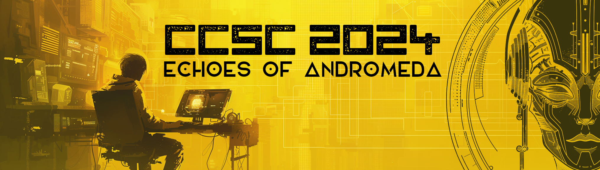

# Cyprus Cyber Security Challenge CTF 2024

**Dates:** 01/05/2024 - 12/05/2024

## Repository Structure

This is the official repository with the challenges published in Cyprus Cyber Security Challenge (CCSC) CTF 2024. Each challenge has a public, solution and setup folder (if applicable) and is accompanied with a short description. The setup folder contains all the files required to build and host the challenge and usually contains the flag and a proof of concept solution as well. The public folder contains the files that are released to the participant during the competition.

## Dependencies

Although some of the challenges may run as is, it is recommended that you have docker and docker-compose installed and use the provided scripts to run the challenges to ensure isolation and therefore proper environment setup.

## Challenges

### crypto

| Name | Author |
| ---- | ------ |
| [Andromeda Cloud Storage](./crypto/andromeda-cloud-storage) | feltf |
| [Andromeda Cloud Storage v2](./crypto/andromeda-cloud-storage-v2) | feltf |

### misc

| Name | Author |
| ---- | ------ |
| [Metadata Matters](./misc/metadata-matters) | YetAnotherAlt123 |
| [Password Keep](./misc/password-keep) | YetAnotherAlt123 |
| [Superguesser Part 1](./misc/superguesser) | koks |
| [Superguesser Part 2](./misc/superguesser_2) | koks |
| [Superguesser Part 3](./misc/superguesser_3) | koks |

### pwn

| Name | Author |
| ---- | ------ |
| [Infiltration](./pwn/infiltration) | neo |
| [Model Scan](./pwn/model-scan) | neo |

### web

| Name | Author |
| ---- | ------ |
| [Arcane Nebula](./web/arcane-nebula) | koks |
| [Cross Checked Report](./web/cross-checked-report) | YetAnotherAlt123 |

